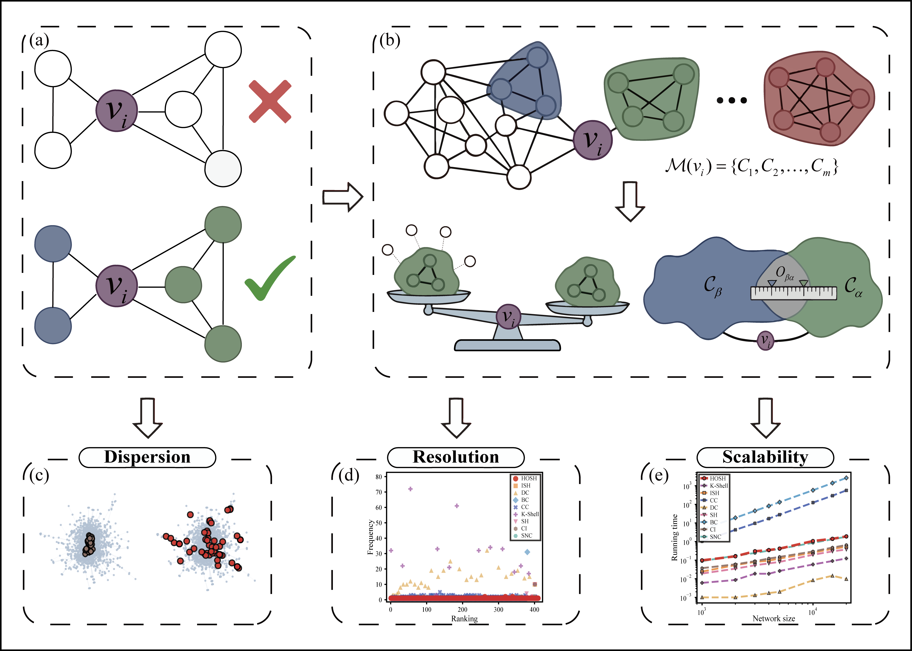

# HOSH: Higher-Order Structural Holes: a Critical Node Identification Method Based on Maximal Cliques
-------------------



### Framework Overview

> **Figure 1: Schematic overview of the HOSH framework.** **(a) Core Unit**: Shifting the fundamental unit of network analysis from binary edges to maximal cliques. **(b) Algorithmic Pipeline**: After maximal clique decomposition, the basic investment is adjusted by the relative autonomy coefficient to compute effective dependence, and the inter-clique redundancy caused by topological overlap is quantified. **(c)-(e) Performance Advantages**: Outstanding performance in spatial Dispersion, ranking Resolution, and computational Scalability.

* * *

## 1. System Requirements

* **Python 3.8+**
* **Required Packages**: `networkx`, `numpy`, `pandas`, `scipy`, `matplotlib`, `tqdm`, `openpyxl`

* * *

## 2. Overview

Traditional structural hole theory effectively identifies bridging nodes in complex networks; however, existing methods predominantly rely on a binary edge interaction perspective, often overlooking the higher-order group structures prevalent in real-world systems.

**Higher-Order Structural Holes (HOSH)** is a novel critical node identification method based on maximal cliques. It elevates the fundamental unit of topological analysis from individual edges to mesoscopic **Maximal Cliques**. By integrating resource dependence theory, HOSH quantifies the **effective dependence** of a node on its affiliated cliques and the **inter-clique redundancy** caused by topological overlap, thereby reconstructing the structural constraint mechanism within a higher-order architecture.

Experimental results demonstrate that HOSH not only accurately identifies nodes with highly discrete spatial distributions to maximize global spreading coverage, but also possesses exceptional ranking resolution (with an average monotonicity of 0.9901), while maintaining linear time complexity in sparse networks.

* * *

## 3. Repository Structure

```text
HOSH_Project/
│
├── core/                             # Core algorithms and data processing modules
│   ├── hosh_methods.py               # Implementation of HOSH and baseline methods
│   ├── network_loader.py             # Automated data downloader and LCC preprocessing tool
│   └── precompute_rankings.py        # Precomputation and caching engine for node rankings
│
├── experiments/                      # Multi-dimensional performance evaluation scripts
│   ├── exp_sir_influence.py          # Exp 1: Steady-state SIR spreading scale analysis
│   ├── exp_temporal_sir.py           # Exp 2: Temporal SIR spreading evolution curves
│   ├── exp_improvement_rate.py       # Exp 3: Improvement rate sensitivity analysis (Bubble heatmap)
│   ├── exp_monotonicity.py           # Exp 4: Ranking monotonicity M(R) statistical analysis
│   ├── exp_ranking_frequency.py      # Exp 5: Ranking degeneracy frequency distribution visualization
│   ├── exp_spreader_separation.py    # Exp 6: Spreader spatial dispersion analysis (Radar chart)
│   ├── exp_topology_visualization.py # Exp 7: Top-50 nodes network topology visualization
│   ├── exp_parameter_sensitivity.py  # Exp 8: HOSH parameter ξ robustness validation (Kendall's Tau)
│   ├── exp_running_time.py           # Exp 9: Running time comparison on real-world networks
│   └── exp_synthetic_networks.py     # Exp 10: Linear scalability validation on synthetic networks
│
├── tools/                            # Auxiliary statistics and verification tools
│   ├── compute_network_statistics.py # Calculate basic network topological properties
│   └── verify_networks.py            # Dataset integrity and LCC verification
│
├── images/                           # Project images and diagrams
│   └── graphicalabstract.png         # Algorithmic framework overview diagram
│
├── networks_data/                    # Directory for raw network datasets (Auto-generated)
├── results/                          # Directory for experimental results output
│   ├── node_rankings/                # Cached files for precomputed node scores (.pkl)
│   └── exp_*/                        # Output subdirectories for each experimental module
│
└── README.md                         # Project documentation
````

* * *

4\. File Descriptions
---------------------

### 4.1 Core Algorithms and Data Loading (`core/`)

**Scripts:**

| File | Description |
| --- | --- |
| `hosh_methods.py` | **Core Algorithm Library**. Implements the computational interfaces for the HOSH algorithm and 8 baseline algorithms (DC, BC, CC, K-Shell, CI, SH, ISH, SNC). |
| `network_loader.py` | **Data Preprocessing**. Automates downloading from the SuiteSparse collection, graph un-direction, self-loop removal, and Largest Connected Component (LCC) extraction. |
| `precompute_rankings.py` | **Cache Management**. Precomputes node scores for all methods across all networks and serializes them for high-speed reading by experimental scripts. |

**Data Files:**

| File                                   | Description |
|----------------------------------------| --- |
| `results/node_rankings/*.pkl` | stores dictionary objects of precomputed node scores for quick loading by downstream scripts. |

### 4.2 Experimental Evaluation and Visualization (`experiments/`)

**Scripts:**

| File | Description |
| --- | --- |
| `exp_sir_influence.py` | Evaluates the steady-state infection scale  $F\left(t_{c}\right)$  under varying initial seed ratios  $p$  (2.5%-25%). |
| `exp_temporal_sir.py` | Tracks the temporal spreading evolution trajectories using the Top-10 nodes as initial seeds. |
| `exp_improvement_rate.py` | Analyzes the improvement rate of HOSH relative to baseline algorithms under different infection probabilities  $\beta /\beta _{th}$  (Bubble Heatmap). |
| `exp_monotonicity.py` | Calculates the ranking monotonicity  $M\left(R\right)$  to validate the algorithm's performance in finely distinguishing node differences. |
| `exp_ranking_frequency.py` | Calculates the frequency distribution of nodes per ranking position to visually expose the ranking degeneracy problem. |
| `exp_spreader_separation.py` | Computes the average shortest path length  $L_{s}$  of seed nodes, reflecting the spatial coverage capability and dispersion of spreaders. |
| `exp_topology_visualization.py` | Highlights the Top-50 nodes in the network, visualizing their topological distributions across independent subplots. |
| `exp_parameter_sensitivity.py` | Uses Kendall's $\tau$ to evaluate the sensitivity and robustness of the HOSH algorithm to the parameter $\xi$. |
| `exp_running_time.py` | Measures the actual execution time of algorithms across various real-world networks. |
| `exp_synthetic_networks.py` | Validates the computational time growth trend relative to network size on synthetic networks (BA, WS, ER, 1k-20k nodes). |

**Data Files (Output):**

| File | Description |
| --- | --- |
| `results/exp_*/*.png` | High-resolution figures (600 DPI), including spreading curves, bubble heatmaps, radar charts, and topological subplots. |
| `results/exp_*/*.xlsx` | Quantitative experimental data corresponding to the generated figures, organized by experiment type. |
| `results/exp_*/*.txt` or `.csv`| Detailed numerical records for scalability tests, empirical running times, and backup statistical data for analyses. |
* * *

5\. Execution Pipeline
----------------------

Please run the scripts in the following order from the project root directory to reproduce the paper's experiments:

```
Step 1: python -m tools.verify_networks          → Download network datasets and verify LCC extraction
          ↓
Step 2: python -m core.precompute_rankings       → Precompute node rankings (CRITICAL: Generates score cache files)
          ↓
Step 3: python -m experiments.exp_sir_influence  → Run core SIR influence evaluation
          ↓
Step 4: python -m experiments.exp_monotonicity   → Calculate discriminative power metrics and export to Excel
          ↓
Step 5: python -m experiments.[other_scripts]    → Generate radar charts, topology visualizations, or scalability curves as needed
```

> **Execution Note**: This project adopts a Python modular import pattern. Ensure commands are executed from the **project root directory** and use the `-m` flag (e.g., `python -m core.hosh_methods`) to prevent relative import errors.

* * *

6\. Notes
---------

*   **Score Caching Mechanism**: Scripts under `experiments/` will prioritize loading the `.pkl` files in `results/node_rankings/`. If you modify the core algorithmic logic, you must rerun `precompute_rankings.py` with the `--force` flag.
*   **Local Datasets**: Datasets marked as `local` in `network_loader.py` (e.g., `infect`, `chesapeake`) must be manually placed in the `networks_data/` directory.
*   **Output Standards**: All generated figures default to a 600 DPI resolution and use the Times New Roman font.

* * *

